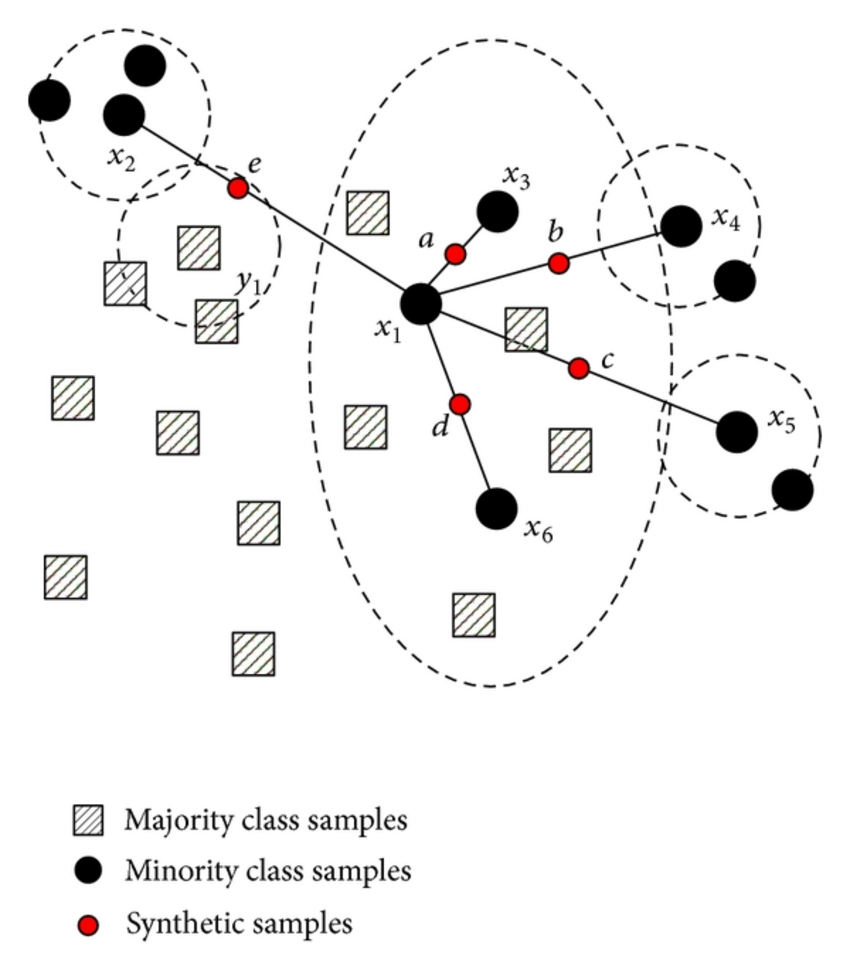
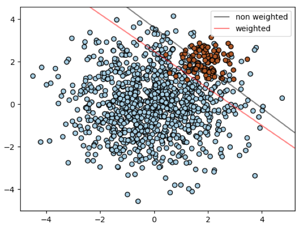

# Fraud detection in credit card transactions

## Introduction

The objective of this project is the unbalanced classification of data.
This class imbalance clearly increases the difficulty of learning by the classification algorithm. This is because the algorithm has only a few examples of the minority class to learn from. It is therefore biased towards the population of negatives and produces predictions that are potentially less robust than in the absence of imbalance.

## Data

We will use the credit card fraud dataset from [Kaggle](https://www.kaggle.com/datasets/mlg-ulb/creditcardfraud). The dataset contains a set of transactions from a credit card company.

### Features
It presents transactions that occurred in two days, where we have 492 frauds out of 284,807 transactions. The dataset is highly unbalanced, the positive class (frauds) account for 0.172% of all transactions.

There are 31 variables in this database, 28 of which come from a PCA transformation (principal component analysis) because unfortunately the primary characteristics contain confidential data that cannot be provided. These variables are columns `V1`, `V2`, ..., up to `V28`.

The only data that has not been transformed are the `Time`, `Amount` and `Class` columns.

- `Time` contains the elapsed time between each transaction and the first database transaction.

- `Amount` on the other hand contains transaction amounts and this feature can be useful in recognizing the sensitivity and importance of transaction costs.

- Finally, `Class` is the last variable which is worth 1 if the transaction is a fraud and 0 otherwise.

### Missing values
There are no missing values in this dataset.

### Statistics
- **Transaction amount distribution:**


For transaction amounts, we notice that the median of fraudulent transactions is lower. This is due to the fact that during an operation, it is better to carry out several transactions of small amounts in order not to be distinguished.

- **Time distribution:**
  


- **Correlation matrix:**
  
As mentioned before, the database is the result of a principal component analysis, so a priori there is no need to check for relevancy between the columns. And as a result, the correlation matrix is very sparse.


We note that there is a correlation between the `Amount` and `Class` variables which may allow us to facilitate the classification later, to guess if a transaction is fraudulent or not, since the amount of a transaction can be an important factor in deciding whether a transaction is fraudulent or not.

## Analysis
In our analysis, we will use a logistic regression classifier to classify the transactions.

The logistic regression algorithm will measure the relationship between the "Label" Y and the "Features" X by estimating the probabilities using a logistic function called a sigmoid function. This is the function represented in the following figure and which aims to separate fraudulent transactions from non-fraudulent ones.


*In all the following models, we will separate our data set into 2 groups: a training set and a test set. The regression is performed with a decision threshold of 0.5.*

We will first use the classification on all our data.

### 1. Complete data:

-> Occurences of classes in the training set:

   
        0         1
        181953   323
   
We apply the logistic regression algorithm to the complete data set.

```R
   model <- glm(Fraud~., data = train_set, family = binomial )
    predictions <- predict(model, test_set, type='response')
    predictions.results <- ifelse(predictions > 0.5, "1", "0")
    confusionMatrix(as.factor(predictions.results), as.factor(test_set$Fraud), positive = "1")
```

        Confusion Matrix and Statistics
    
              Reference
        Prediction     0     1
                0 45483    33
                1     6    47
                                              
                   Accuracy : 0.9991          
                     95% CI : (0.9988, 0.9994)
        No Information Rate : 0.9982          
        P-Value [Acc > NIR] : 2.756e-07       
                                              
                      Kappa : 0.7064          
                                              
        Mcnemar's Test P-Value : 3.136e-05       
                                              
                Sensitivity : 0.587500        
                Specificity : 0.999868        
             Pos Pred Value : 0.886792        
             Neg Pred Value : 0.999275        
                 Prevalence : 0.001756        
             Detection Rate : 0.001031        
        Detection Prevalence : 0.001163        
          Balanced Accuracy : 0.793684        
                                              
           'Positive' Class : 1                        

We note that the accuracy of our model is 99.9%. At first glance, the model seems efficient, but in the case of class imbalance, the accuracy can be misleading. With a dataset of two classes, where the first class represents 99% of the data, if the classifier predicts that each example belongs to the first class, the accuracy will be 99%, but this classifier is useless in practice.

### 2. UpSampling with duplicates:

Upsampling or random oversampling consists of supplementing the training data with multiple copies of some instances of the minority class.

    -> Occurences of classes in the training set:

        0      1 
        284315 284315 

We can see that our data has become balanced after adding several copies of fraudulent transactions.

We then perform the logistic regression:

    Confusion Matrix and Statistics
    
              Reference
    Prediction     0     1
             0 44547  3594
             1   943 41896
                                              
                   Accuracy : 0.9501          
                     95% CI : (0.9487, 0.9515)
        No Information Rate : 0.5             
        P-Value [Acc > NIR] : < 2.2e-16       
                                              
                      Kappa : 0.9003          
                                              
     Mcnemar's Test P-Value : < 2.2e-16       
                                              
                Sensitivity : 0.9210          
                Specificity : 0.9793          
             Pos Pred Value : 0.9780          
             Neg Pred Value : 0.9253          
                 Prevalence : 0.5000          
             Detection Rate : 0.4605          
       Detection Prevalence : 0.4709          
          Balanced Accuracy : 0.9501          
                                              
           'Positive' Class : 1               
                                              

We obtain a *balanced accuracy* of 95%, but with this method we risk having an overfitting for fraudulent transactions.

### 3. UpSampling with SMOTE method:

To overcome the disadvantage imposed by a normal upsamling, the Smote method (Synthetic Minority Oversampling Technique) can be used. The idea of ​​SMOTE is to increase the recall for the minority class by generating synthetic individuals on the segments between elements close to the minority class.



-> Occurences of classes in the training set:

            0      1 
        283884 284376 

We can see that we have generated as many fraudulent transactions as non-fraudulent ones.


    Warning message:
    "glm.fit: fitted probabilities numerically 0 or 1 occurred"
    


    Confusion Matrix and Statistics
    
              Reference
    Prediction     0     1
             0 44378  3406
             1  1040 42096
                                              
                   Accuracy : 0.9511          
                     95% CI : (0.9497, 0.9525)
        No Information Rate : 0.5005          
        P-Value [Acc > NIR] : < 2.2e-16       
                                              
                      Kappa : 0.9022          
                                              
     Mcnemar's Test P-Value : < 2.2e-16       
                                              
                Sensitivity : 0.9251          
                Specificity : 0.9771          
             Pos Pred Value : 0.9759          
             Neg Pred Value : 0.9287          
                 Prevalence : 0.5005          
             Detection Rate : 0.4630          
       Detection Prevalence : 0.4744          
          Balanced Accuracy : 0.9511          
                                              
           'Positive' Class : 1               
                                              


The regression model became more efficient with a balanced accuracy of 95.11%.

But this model can lead to errors in our model, especially since in the banking sector, we work with sensitive data to detect fraud. So we cannot generate data (~240000 fraudulent transactions) to model the logistic regression.

### 4. Weighted logistic regression:

In most machine learning models, they accept a `weight` parameter. It is used to apply a cost inversely proportional to the class imbalance. Visually, this allows to bias the model towards the minority class as illustrated below where the decision boundary of a linear kernel SVM is translated towards the minority class.
.

In our case, we define the weight of the minority class as follow:

$$
\text{weight}= \frac{\sum(\text{non frauduleuses)}}{\sum(\text{frauduleuses)}}
$$

We apply the weighted logistic regression:

    Confusion Matrix and Statistics
    
              Reference
    Prediction     0     1
             0 45490     0
             1     0    78
                                         
                   Accuracy : 1          
                     95% CI : (0.9999, 1)
        No Information Rate : 0.9983     
        P-Value [Acc > NIR] : < 2.2e-16  
                                         
                      Kappa : 1          
                                         
     Mcnemar's Test P-Value : NA         
                                         
                Sensitivity : 1.000000   
                Specificity : 1.000000   
             Pos Pred Value : 1.000000   
             Neg Pred Value : 1.000000   
                 Prevalence : 0.001712   
             Detection Rate : 0.001712   
       Detection Prevalence : 0.001712   
          Balanced Accuracy : 1.000000   
                                         
           'Positive' Class : 1 

After training, we see that we have obtained 100% accuracy, the weighted logistic regression method is effective and more suited to our problem!

